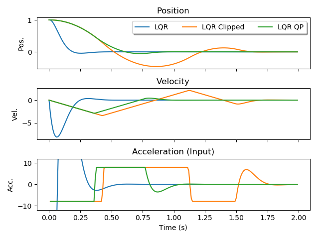

# LQR with Input Constraints

Simulates a 1D point mass controlled using LQR with input constraints. Solving the constrained quadratic program (LQR QP) can in many cases do better than simply thresholding the output of an unconstrained LQR controller.

When following a reference that approaches input constraints, state feedback noise can make the thresholded LQR suboptimal. The quadratic program LQR is again better here.

")

## Usage

Run [constrained_lqr.py](constrained_lqr.py). Pass `--ref` to follow a bang bang reference and `--noise` to inject noise into the state feedback.

Change `w_pos`, `w_vel`, `max_abs_u`, and `N` to experiment with different cost functions, input constraints, and horizon lengths.

## Dependencies

* numpy
* matplotlib
* one of scipy or [qpoases](https://projects.coin-or.org/qpOASES/)' Python interface to solve the quadratic program. qpoases runs much faster and is recommended.

## Issues

If you get an undefined symbol error when using qpoases, see <https://projects.coin-or.org/qpOASES/ticket/70>.
